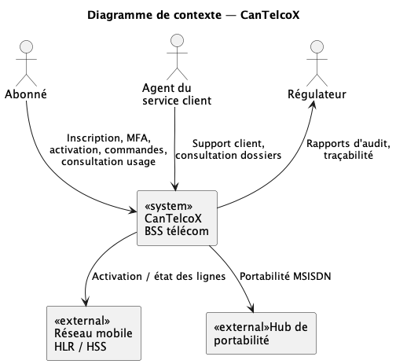
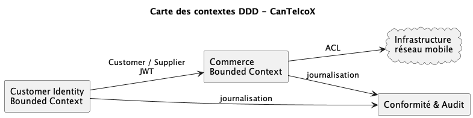
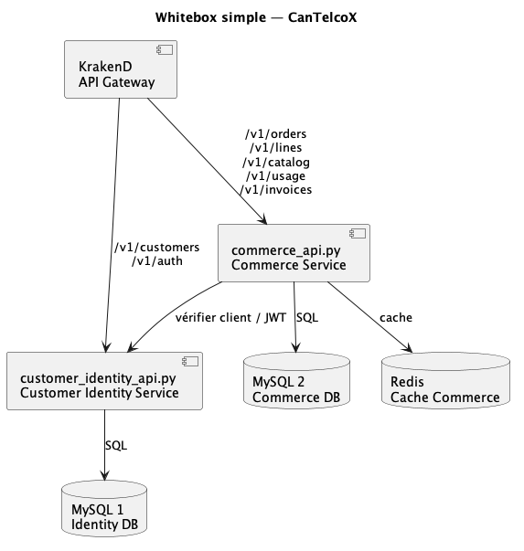
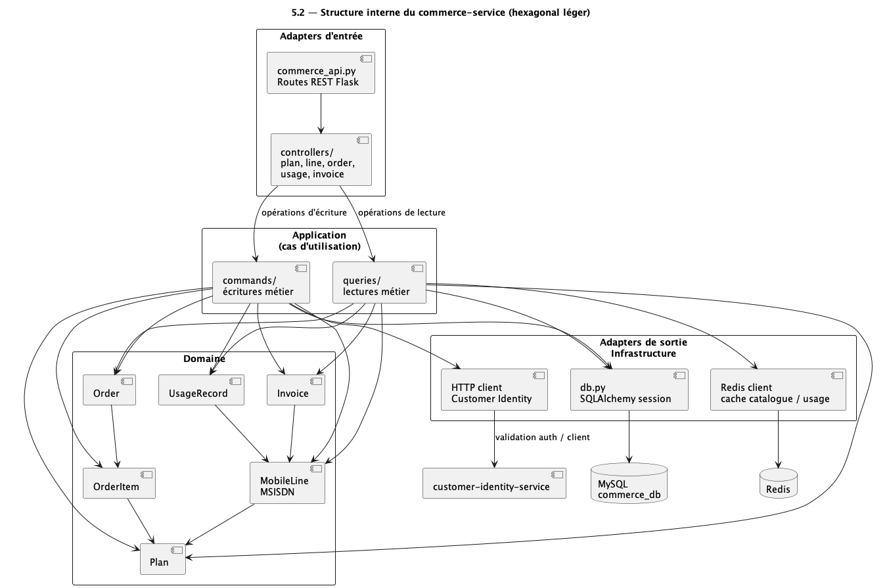
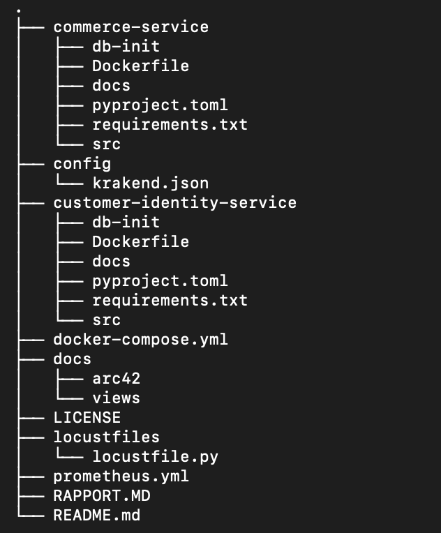
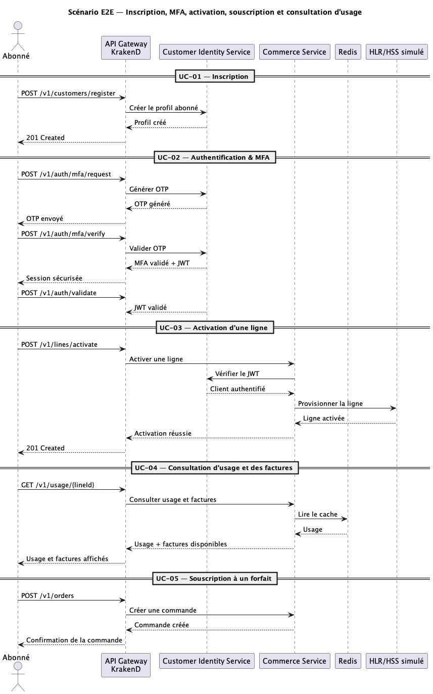
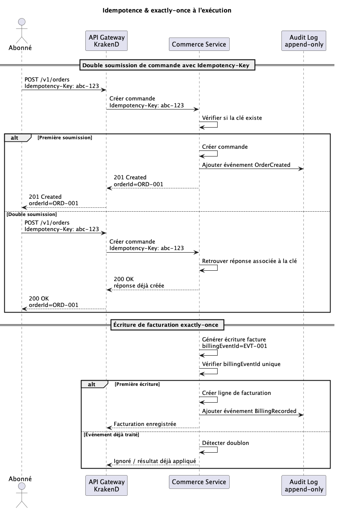
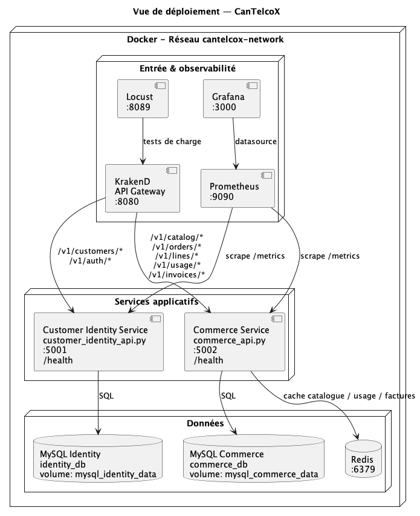

**L O G 4 3 0**

Architecture logicielle — Été 2026

**Phase 1 — Architecture basée par services**

**(microservices)**

Dossier d’architecture — gabarit Arc42 + vues 4+1 + ADR

_Projet CanTelcoX — Système de support commercial (BSS) télécom_

|                                   |                                          |
| --------------------------------- | ---------------------------------------- |
| **Équipe / N° d’équipe**          | _[À compléter — nom d’équipe et numéro]_ |
| **Membres (nom, code permanent)** | _[À compléter — liste des membres]_      |
| **Cours / Groupe**                | LOG430 — Groupe \_\_\_                   |
| **Session**                       | Été 2026                                 |
| **Date de remise**                | 30 juin 2026, 23 h 59 (Moodle)           |
| **Version du document**           | _[À compléter — ex. v1.0 — date]_        |

École de technologie supérieure — Département de génie logiciel et des TI

# Sommaire

_Mettez à jour le sommaire dans Word (clic droit → « Mettre à jour les champs ») une fois le document complété._

[Sommaire](#sommaire)

[Comment utiliser ce gabarit](#comment-utiliser-ce-gabarit)

[Correspondance Tâches de l’énoncé → Sections du document](#correspondance-tâches-de-lénoncé-sections-du-document)

[1. Introduction et objectifs](#introduction-et-objectifs)

[1.1 Aperçu des exigences](#aperçu-des-exigences)

[1.2 Cas d’utilisation Must (MoSCoW)](#cas-dutilisation-must-moscow)

[1.3 Objectifs de qualité](#objectifs-de-qualité)

[1.4 Parties prenantes](#parties-prenantes)

[2. Contraintes d’architecture](#contraintes-darchitecture)

[2.1 Contraintes techniques](#contraintes-techniques)

[2.2 Contraintes réglementaires & conformité](#contraintes-réglementaires-conformité)

[2.3 Contraintes organisationnelles & conventions](#contraintes-organisationnelles-conventions)

[3. Contexte et périmètre](#contexte-et-périmètre)

[3.1 Contexte métier](#contexte-métier)

[3.2 Contexte technique](#contexte-technique)

[3.3 Cartographie du domaine (DDD)](#cartographie-du-domaine-ddd)

[4. Stratégie de solution](#stratégie-de-solution)

[4.1 Style architectural & découpage en services](#style-architectural-découpage-en-services)

[4.2 Communication inter-services](#communication-inter-services)

[4.3 Stratégie de l’API REST](#stratégie-de-lapi-rest)

[4.4 Référence industrielle TMF (optionnelle)](#référence-industrielle-tmf-optionnelle)

[5. Vue des blocs de construction](#vue-des-blocs-de-construction)

[5.1 Niveau 1 — Décomposition en services](#niveau-1-décomposition-en-services)

[5.2 Niveau 2 — Structure interne d’un service (hexagonal)](#niveau-2-structure-interne-dun-service-hexagonal)

[5.3 Modèle de domaine](#modèle-de-domaine)

[5.4 Organisation du code (vue Développement)](#organisation-du-code-vue-développement)

[6. Vue d’exécution](#vue-dexécution)

[6.1 Scénario bout-en-bout (E2E)](#scénario-bout-en-bout-e2e)

[6.2 Authentification & MFA (UC-02)](#authentification-mfa-uc-02)

[6.3 Idempotence & exactly-once à l’exécution](#idempotence-exactly-once-à-lexécution)

[7. Vue de déploiement](#vue-de-déploiement)

[7.1 Topologie de déploiement](#topologie-de-déploiement)

[7.2 API Gateway](#api-gateway)

[7.3 Load balancing & tolérance aux pannes](#load-balancing-tolérance-aux-pannes)

[8. Concepts transversaux](#concepts-transversaux)

[8.1 Persistance & intégrité](#persistance-intégrité)

[8.2 Idempotence (commandes & activations)](#idempotence-commandes-activations)

[8.3 Exactly-once (facturation)](#exactly-once-facturation)

[8.4 Journal d’audit append-only (CRTC / Loi 25)](#journal-daudit-append-only-crtc-loi-25)

[8.5 Sécurité applicative](#sécurité-applicative)

[8.6 Contrôles anti-fraude](#contrôles-anti-fraude)

[8.7 Gestion d’erreurs & versionnement](#gestion-derreurs-versionnement)

[8.8 Observabilité (4 Golden Signals)](#observabilité-4-golden-signals)

[8.9 Caching](#caching)

[9. Décisions d’architecture (ADR)](#décisions-darchitecture-adr)

[ADR-001 — Style architectural & découpage en services](#adr-001-style-architectural-découpage-en-services)

[ADR-002 — Persistance & transactions (idempotence / exactly-once / append-only)](#adr-002-persistance-transactions-idempotence-exactly-once-append-only)

[ADR-003 — Stratégie d’erreurs & versionnement d’API](#adr-003-stratégie-derreurs-versionnement-dapi)

[10. Exigences de qualité](#exigences-de-qualité)

[10.1 Arbre de qualité](#arbre-de-qualité)

[10.2 Scénarios de qualité](#scénarios-de-qualité)

[10.3 Cibles NFR & résultats](#cibles-nfr-résultats)

[10.4 Stratégie de tests & couverture](#stratégie-de-tests-couverture)

[10.5 Résultats des campagnes de charge](#résultats-des-campagnes-de-charge)

[10.6 Load balancing (N = 1..4) & tolérance aux pannes](#load-balancing-n-1..4-tolérance-aux-pannes)

[10.7 Caching (on / off)](#caching-on-off)

[10.8 Appels directs vs via Gateway](#appels-directs-vs-via-gateway)

[11. Risques et dette technique](#risques-et-dette-technique)

[12. Glossaire](#glossaire)

[12.1 Langage métier](#langage-métier)

[12.2 Acronymes](#acronymes)

[Annexe A — Contrats d’API & catalogue d’endpoints](#annexe-a-contrats-dapi-catalogue-dendpoints)

[Annexe B — Schéma de persistance](#annexe-b-schéma-de-persistance)

[Annexe C — CI/CD, conteneurisation & exploitation](#annexe-c-cicd-conteneurisation-exploitation)

[Annexe D — Traçabilité, Définition de Fini & auto-évaluation](#annexe-d-traçabilité-définition-de-fini-auto-évaluation)

[D.1 Matrice de traçabilité (livrables & critères d’acceptation)](#d.1-matrice-de-traçabilité-livrables-critères-dacceptation)

[D.2 Définition de Fini (DoD)](#d.2-définition-de-fini-dod)

[D.3 Auto-évaluation (grille de l’énoncé)](#d.3-auto-évaluation-grille-de-lénoncé)

[Annexe E — Soutenance et démonstration (20 %)](#annexe-e-soutenance-et-démonstration-20)

[E.1 Déroulé attendu](#e.1-déroulé-attendu)

[E.2 Grille de soutenance](#e.2-grille-de-soutenance)

[E.3 Plan de soutenance (à préparer)](#e.3-plan-de-soutenance-à-préparer)

# Comment utiliser ce gabarit

Ce gabarit structure le dossier d’architecture de la Phase 1 selon le modèle Arc42 (sections 1 à 12) et y intègre les cinq vues 4+1. Chaque section rappelle, dans une boîte « Repères de l’énoncé », les tâches concernées, les livrables attendus et les critères d’acceptation (CA) à cocher. Remplacez chaque mention [À compléter — …] par votre contenu, insérez vos diagrammes là où indiqué, puis cochez les CA au fur et à mesure.

> **Conventions**
>
> - Texte en gris entre crochets = consigne à remplacer par votre contenu.
> - Cases ☐ = critères d’acceptation de l’énoncé ; cochez-les lorsque la preuve est dans le dépôt ou le rapport.
> - Insérez les diagrammes (PlantUML, Mermaid, draw.io…) sous forme d’images exportées ; nommez-les et numérotez les figures.
> - Le dossier final est remis en PDF ; ce gabarit Word sert de source. Visez la reproductibilité < 30 min sur la VM.
> - **Le gabarit est une structure minimale, pas un plafond :** ajoutez toute sous-section ou tout contenu pertinent demandé par l’énoncé. Les justifications de décisions (« pourquoi ce choix plutôt qu’un autre ») vont en priorité dans les ADR (§9) et la colonne « Justification (→ ADR) » du §4 ; les sections descriptives (§1–§8) présentent surtout l’architecture retenue.

## Correspondance Tâches de l’énoncé → Sections du document

Tableau de navigation : où documenter chaque tâche du devoir. La matrice de traçabilité détaillée (avec statut) figure en Annexe D.

| **Tâche (énoncé)**                  | **Où la documenter**                                              |
| ----------------------------------- | ----------------------------------------------------------------- |
| 1.1 Cas d’utilisation Must (MoSCoW) | **§1 Introduction & objectifs · §10 Scénarios de qualité**        |
| 1.2 Cartographie DDD                | **§3 Carte des contextes · §5 Modèle de domaine · §12 Glossaire** |
| 2.1 Découpage microservices         | **§4 Stratégie de solution · §5 Vue des blocs**                   |
| 2.2 Couche API REST                 | **§4.4 · Annexe A (contrats OpenAPI/Postman)**                    |
| 2.3 Documentation 4+1 + Arc42       | Ensemble du document                                              |
| 2.4 ADR (≥ 3)                       | **§9 Décisions d’architecture**                                   |
| 3.1 Schéma de persistance           | **§8.1 · Annexe B (ER/UML, migrations, seeds)**                   |
| 3.2 Persistance & intégrité         | **§8.1–8.4 · Annexe B**                                           |
| 4.1 Domaine & services applicatifs  | **§5.3 Modèle de domaine**                                        |
| 4.2 Ports/adapters                  | **§3.2 Contexte technique · §5.2 Structure interne**              |
| 4.3 API REST publique (E2E)         | **§6 Vue d’exécution · Annexe A**                                 |
| 4.4 Sécurité applicative            | **§8.5 Sécurité · §8.6 Anti-fraude**                              |
| 5.1 Observabilité                   | **§8.8 · §10.5 (dashboards)**                                     |
| 5.2 Tests de charge                 | **§10.5**                                                         |
| 5.3 Load balancing                  | **§7.3 · §10.6**                                                  |
| 5.4 Caching                         | **§8.9 · §10.7**                                                  |
| 6.1 API Gateway                     | **§7.2**                                                          |
| 6.2 Direct vs Gateway               | **§10.8**                                                         |
| 7.1 Stratégie de tests              | **§10.4**                                                         |
| 7.2 Sécurité & gestion d’erreurs    | **§8.5–8.7**                                                      |
| 8.1–8.3 CI/CD & conteneurisation    | **§7.1 · Annexe C**                                               |
| 9.1 Documentation finale            | Ensemble · Annexe C (runbook)                                     |
| 9.2 Rapport comparatif              | **§10.6–10.8**                                                    |

# 1. Introduction et objectifs

**\*Objectif Arc42 —** Présenter le système, ses objectifs métier essentiels, les objectifs de qualité prioritaires et les parties prenantes.\*

> **Repères de l’énoncé**
>
> **Tâches de l’énoncé :** 1.1 Clarifier le périmètre & cas d’utilisation Must.
>
> **Vue 4+1 :** Scénarios (cas d’utilisation).
>
> **Livrables attendus :**
>
> - UC textuels (scénario principal + alternatifs) pour ≥ 5 UC Must.
> - Priorisation MoSCoW alignée sur les domaines du cahier.

**Critères d’acceptation (à cocher)**

> x ≥ 5 UC Must (parmi UC-01 à UC-08) entièrement décrits et validés.
>
> x Priorisation MoSCoW justifiée et matrice de traçabilité UC ↔ domaines complétée.

## 1.1 Aperçu des exigences

CanTelcoX, opérateur mobile canadien fictif, déploie un BSS moderne pour abonnés particuliers et PME couvrant le cycle de vie des lignes mobiles : souscription, activation, consultation d’usage, prise de commande de forfaits/options, paiement de facture et conformité réglementaire.

CanTelcoX est une plateforme qui permet aux abonnés de gérer leurs services mobiles en ligne. Les utilisateurs peuvent créer un compte, se connecter de façon sécurisée, activer une ligne, choisir un forfait ou des options et consulter leur consommation ainsi que leurs factures. Pour la phase 1, le projet met l'accent sur la mise en place d'une architecture à microservices avec une API Gateway, ainsi que sur l'implémentation des cinq premiers cas d'utilisation (UC-01 à UC-05), qui représentent les principales fonctionnalités offertes aux abonnés.

## 1.2 Cas d’utilisation Must (MoSCoW)

Catalogue de référence des UC du cahier :

| **UC** | **Intitulé**                          | **Priorité MoSCoW** |
| ------ | ------------------------------------- | ------------------- |
| UC-01  | Inscription & vérification d’identité | Must                |
| UC-02  | Authentification & MFA                | Must                |
| UC-03  | Activation d’une ligne                | Must                |
| UC-04  | Consultation usage / factures         | Must                |
| UC-05  | Prise de commande                     | Must                |
| UC-06  | Paiement de facture                   | Should              |
| UC-07  | Détection de fraude                   | Could               |
| UC-08  | Cycle de facturation mensuel          | Could               |

**Justification de la priorisation MoSCoW**

Les cas d'utilisation UC-01 à UC-05 ont été classés Must, car ils couvrent les fonctionnalités de base de la plateforme : créer un compte, s'authentifier, activer une ligne mobile, souscrire à un forfait et consulter son usage. Ils représentent le parcours principal d'un abonné et permettent de mettre en pratique les principaux concepts du projet, comme les microservices, la communication entre services, la persistance des données et l'observabilité. Les UC-06 (Paiement de facture), UC-07 (Détection de fraude) et UC-08 (Cycle de facturation mensuel) ont été classés Should ou Could, puisqu'ils correspondent à des fonctionnalités plus avancées qui pourront être ajoutées dans une prochaine phase.

**Matrice de traçabilité UC ↔ domaines du cahier (bounded contexts)**

Cochez (✓) le ou les domaines couverts par chaque UC, pour démontrer l’alignement avec le cahier. Ajustez selon les UC réellement retenus.

|                                     |                        |                       |                             |                        |                         |                        |
| ----------------------------------- | ---------------------- | --------------------- | --------------------------- | ---------------------- | ----------------------- | ---------------------- |
| **UC**                              | **Clients & Identité** | **Lignes & Services** | **Commandes & Activations** | **Catalogue & Offres** | **Usage / Facturation** | **Conformité & Audit** |
| UC-01 Inscription & identité        | ✓                      |                       |                             |                        |                         | ✓                      |
| UC-02 Authentification & MFA        | ✓                      |                       |                             |                        |                         | ✓                      |
| UC-03 Activation d’une ligne        |                        | ✓                     | ✓                           | ✓                      |                         | ✓                      |
| UC-04 Consultation usage / factures |                        | ✓                     |                             |                        | ✓                       |                        |
| UC-05 Prise de commande             |                        | ✓                     | ✓                           | ✓                      |                         |                        |
| UC-06 Paiement de facture           |                        |                       |                             |                        | ✓                       | ✓                      |
| UC-07 Détection de fraude           |                        | ✓                     | ✓                           |                        | ✓                       | ✓                      |
| UC-08 Cycle de facturation          |                        |                       |                             |                        | ✓                       | ✓                      |

**Détaillez ci-dessous les ≥ 5 UC retenus (un sous-bloc par UC) :**

## UC-01 — Inscription & vérification d'identité

| **Champ**                              | **Contenu**                                                                                                                                                                                              |
| -------------------------------------- | -------------------------------------------------------------------------------------------------------------------------------------------------------------------------------------------------------- |
| **UC retenu**                          | UC-01 — Inscription & vérification d'identité                                                                                                                                                            |
| **Acteurs**                            | Abonné                                                                                                                                                                  |
| **Préconditions**                      | L'utilisateur ne possède pas encore de compte.                                                                                                                                                           |
| **Scénario principal**                 | 1. L'utilisateur remplit le formulaire d'inscription. 2. Le système valide les informations. 3. Un code OTP est envoyé. 4. L'utilisateur saisit le code. 5. Le système crée un profil actif. |
| **Scénarios alternatifs / exceptions** | Courriel déjà utilisé, informations invalides, OTP invalide ou expiré.                                                                                                                                   |
| **Postconditions / règles métier**     | Un profil client actif est créé et l'opération est journalisée.                                                                                                                                          |

## UC-02 — Authentification & MFA

| **Champ**                              | **Contenu**                                                                                                                                                                                                         |
| -------------------------------------- | ------------------------------------------------------------------------------------------------------------------------------------------------------------------------------------------------------------------- |
| **UC retenu**                          | UC-02 — Authentification & MFA                                                                                                                                                                                      |
| **Acteurs**                            | Abonné                                                                                                                                                                     |
| **Préconditions**                      | Le compte est actif.                                                                                                                                                                                                |
| **Scénario principal**                 | 1. L'utilisateur saisit son courriel et son mot de passe. 2. Le système valide les identifiants. 3. Un code MFA est demandé. 4. L'utilisateur valide le code. 5. Le système crée une session sécurisée. |
| **Scénarios alternatifs / exceptions** | Identifiants invalides, code MFA invalide ou expiré, compte verrouillé.                                                                                                                                             |
| **Postconditions / règles métier**     | Une session sécurisée (JWT) est créée et l'accès est accordé.                                                                                                                                                       |

## UC-03 — Activation d'une ligne mobile

| **Champ**                              | **Contenu**                                                                                                                                                                                             |
| -------------------------------------- | ------------------------------------------------------------------------------------------------------------------------------------------------------------------------------------------------------- |
| **UC retenu**                          | UC-03 — Activation d'une ligne mobile                                                                                                                                                                   |
| **Acteurs**                            | Abonné                                                                                                                                                                   |
| **Préconditions**                      | Le client est authentifié et possède un compte actif.                                                                                                                                                   |
| **Scénario principal**                 | 1. L'utilisateur choisit un forfait. 2. Il demande un nouveau numéro ou une portabilité. 3. Le système attribue un numéro mobile. 4. La ligne est activée. 5. Une confirmation est envoyée. |
| **Scénarios alternatifs / exceptions** | Forfait indisponible, numéro invalide, échec d'activation.                                                                                                                                              |
| **Postconditions / règles métier**     | Une ligne active est associée au client et l'opération est journalisée.                                                                                                                                 |

## UC-04 — Consultation de l'usage et des factures

| **Champ**                              | **Contenu**                                                                                                                       |
| -------------------------------------- | --------------------------------------------------------------------------------------------------------------------------------- |
| **UC retenu**                          | UC-04 — Consultation de l'usage et des factures                                                                                   |
| **Acteurs**                            | Abonné                                                                                                              |
| **Préconditions**                      | L'utilisateur est authentifié et possède une ligne active.                                                                        |
| **Scénario principal**                 | 1. L'utilisateur sélectionne une ligne. 2. Le système récupère l'usage courant. 3. Les factures disponibles sont affichées. |
| **Scénarios alternatifs / exceptions** | Ligne inexistante, aucune facture disponible.                                                                                     |
| **Postconditions / règles métier**     | Les informations affichées correspondent aux données enregistrées pour la ligne.                                                  |

## UC-05 — Prise de commande

| **Champ**                              | **Contenu**                                                                                                                                                                                              |
| -------------------------------------- | -------------------------------------------------------------------------------------------------------------------------------------------------------------------------------------------------------- |
| **UC retenu**                          | UC-05 — Prise de commande d'un forfait ou d'une option                                                                                                                                                   |
| **Acteurs**                            | AbonnéCommerce                                                                                                                                                                     |
| **Préconditions**                      | L'utilisateur est authentifié et possède une ligne active.                                                                                                                                               |
| **Scénario principal**                 | 1. L'utilisateur sélectionne un forfait ou une option. 2. Le système valide l'éligibilité. 3. La commande est enregistrée. 4. Les services sont mis à jour. 5. Une confirmation est envoyée. |
| **Scénarios alternatifs / exceptions** | Forfait non admissible, option incompatible, commande déjà traitée.                                                                                                                      |
| **Postconditions / règles métier**     | La commande est enregistrée une seule fois, les services sont mis à jour et l'opération est journalisée.                                                                                                 |

## 1.3 Objectifs de qualité

Les trois objectifs de qualité prioritaires (cibles NFR du cahier) :

| **Objectif de qualité** | **Scénario / motivation**                                                     | **Cible mesurable**                                                                       |
| ----------------------- | ----------------------------------------------------------------------------- | ----------------------------------------------------------------------------------------- |
| Performance             | Réactivité sous charge nominale (UC-04/05)                                    | Latence P95 ≤ 500 ms                                                                      |
| Débit / capacité        | Soutenir le trafic pic                                                        | ≥ 600 opérations/s                                                                        |
| Disponibilité           | Continuité de service lors d’une panne d’instance                             | Disponibilité 95 %                                                                        |
| Sécurité & auditabilité | Protéger les opérations sensibles et garder une trace des actions importantes | MFA obligatoire pour opérations sensibles, 0 secret en clair, journal d’audit append-only |

## 1.4 Parties prenantes

| **Partie prenante**        | **Rôle / attente**                               | **Section concernée** |
| -------------------------- | ------------------------------------------------ | --------------------- |
| Abonnés particuliers / PME | Souscription, usage, paiement                    | **§1, §6**            |
| Opérateur (exploitation)   | Disponibilité, observabilité                     | **§7, §8.8, §10**     |
| Régulateur (CRTC, Loi 25)  | Conformité, auditabilité                         | **§2, §8.4, §9**      |
| Agents du service client   | Gestion des abonnés et des opérations de support | **§3, §6**            |

# 2. Contraintes d’architecture

**Objectif Arc42 —** Recenser les contraintes techniques, réglementaires et organisationnelles qui limitent les choix d’architecture.

## 2.1 Contraintes techniques

| **Contrainte**          | **Description / impact**                                                                              |
| ----------------------- | ----------------------------------------------------------------------------------------------------- |
| Déploiement             | Machine virtuelle fournie ; conteneurisation Docker ; `docker compose up` unique.                     |
| Communication  | Synchrone REST entre services.                                                                        |
| Documentation           | OpenAPI/Swagger ; modèle Arc42 ; vues 4+1 ; ≥ 3 ADR.                                                  |
| Observabilité           | Prometheus + Grafana (4 Golden Signals).                                                              |
| Pile technologique      | Python, Flask, MySQL, Redis (Commerce Service), KrakenD, Docker Compose, Prometheus, Grafana, Locust. |

## 2.2 Contraintes réglementaires & conformité

Le cadre télécom canadien impose des contraintes structurantes (à tracer vers les ADR §9) :

| **Cadre**                             | **Exigence dérivée**                                                                          |
| ------------------------------------- | --------------------------------------------------------------------------------------------- |
| CRTC / Loi sur les télécommunications | Auditabilité des opérations sensibles.                                                        |
| Loi 25 / LPRPDE                       | Protection des renseignements personnels, traçabilité des accès.                              |
| Intégrité transactionnelle            | Idempotence (commandes/activations), exactly-once (facturation), journal d’audit append-only. |
| Lutte à la fraude                     | Contrôles SIM swap, usurpation d’identité, fraude roaming. MFA sur opérations sensibles.     |

## 2.3 Contraintes organisationnelles & conventions

- Conventions de nommage cohérentes pour le code, les commits et les endpoints REST.
- Les secrets (JWT, mots de passe, clés API) sont stockés dans des variables d'environnement (`.env`) et ne sont jamais versionnés.
- Toute la documentation est rédigée en français.
- Les API sont documentées avec Swagger/OpenAPI et testées avec Postman.
- L'ensemble du projet est conteneurisé avec Docker Compose.

# 3. Contexte et périmètre

**\*Objectif Arc42 —** Délimiter le système vis-à-vis de ses partenaires (utilisateurs et systèmes externes) — contextes métier et technique — et cartographier le domaine (DDD).\*

> **Repères de l’énoncé**
>
> **Tâches de l’énoncé :** 1.2 Cartographier le domaine (DDD) ; 4.2 adapters externes simulés.
>
> **Vue 4+1 :** Contexte (alimente Logique et Déploiement).
>
> **Livrables attendus :**
>
> - Diagramme de contexte (système + acteurs + systèmes externes).
> - Bounded contexts et carte des contextes (DDD).
> - Ubiquitous language (reporté au glossaire §12).

**Critères d’acceptation (à cocher)**

> x Frontières de service tracées à partir des bounded contexts.

## 3.1 Contexte métier

## 3.2 Contexte technique

Systèmes externes simulés à intégrer via adapters (ports/adapters) :

| **Système externe simulé** | **Rôle**                                           | **Protocole / adaptateur**   |
| -------------------------- | -------------------------------------------------- | ---------------------------- |
| Réseau mobile HLR/HSS      | Activation et gestion de l'état des lignes mobiles | API REST simulée (JSON/HTTP) |
| Hub de portabilité         | Portabilité d'un numéro (MSISDN)                   | API REST simulée (JSON/HTTP) |
| Passerelle de paiement     | Paiement des factures mobiles (prévu pour phase 2) | API REST simulée (JSON/HTTP) |

## 3.3 Cartographie du domaine (DDD)

Bounded contexts du domaine télécom (frontières de service candidates) :

| **Bounded context**          | **Responsabilité**                                            | **Service candidat**        |
| ---------------------------- | ------------------------------------------------------------- | --------------------------- |
| Clients & Identité           | Profils abonnés,  MFA                 | `customer-identity-service` |
| Lignes & Services            | Lignes mobiles, MSISDN, Sactivation                  | `commerce-service`          |
| Commandes & Activations      | Prise de commande, souscription, activation, idempotence      | `commerce-service`          |
| Catalogue & Offres           | Forfaits                   | `commerce-service`          |
| Usage / Rating / Facturation | Consultation d’usage, génération et consultation des factures | `commerce-service`          |
| Conformité & Audit           | Journal append-only, traçabilité et audit                     | `commerce-service`          |

**Carte des contextes (relations : upstream/downstream, ACL, conformist…) :**

La carte des contextes montre que Customer Identity donne l'authentification au contexte Commerce, qui gère les forfaits, les lignes, les commandes, l'usage et la facturation. Les événements importants sont journalisés pour avoir de la traçabilité.

Les principaux concepts DDD sont matérialisés par un Ubiquitous Language commun entre le code et la documentation, des Aggregates garantissant la cohérence transactionnelle (commit/rollback), et des Repositories/DAO encapsulant l'accès aux données.

# 4. Stratégie de solution

**\*Objectif Arc42 —** Résumer les décisions fondamentales : style architectural, découpage, technologies, atteinte des objectifs de qualité.\*

> **Repères de l’énoncé**
>
> **Tâches de l’énoncé :** 2.1 Concevoir l’architecture microservices ; 2.2 Concevoir la couche API REST.
>
> **Vue 4+1 :** Transversale (préfigure §5–§7).
>
> **Livrables attendus :**
>
> - Choix de découpage en services (≥ 2) et style par service (Hexagonal/MVC).
> - Stratégie de communication inter-services (sync REST en Phase 1).
> - Routes versionnées /v1, codes HTTP normalisés, format d’erreur JSON unifié, contrats OpenAPI.

**Critères d’acceptation (à cocher)**

> x Dépendances dirigées (pas de cycles), couplage contrôlé aux frameworks.
>
> x Bounded contexts mappés sur les services.
>
> x Swagger publié, collection Postman fonctionnelle, séparation domaine ↔ infra.

## 4.1 Style architectural & découpage en services

| **Décision**             | **Choix retenu**                                                                 | **Justification (→ ADR)**                                                                                                                                                                  |
| ------------------------ | -------------------------------------------------------------------------------- | ------------------------------------------------------------------------------------------------------------------------------------------------------------------------------------------ |
| Style global             | Architecture basée par services (microservices)                                  | Permet de séparer les responsabilités métier, de déployer les services indépendamment et de respecter les exigences de modularité, d'observabilité et d'évolutivité. → ADR-001             |
| Découpage (BC → service) |  Customer Identity et Commerce |  Le contexte Commerce regroupe les fonctionnalités de catalogue, commandes, lignes, usage et facturation. → ADR-001 |
| Style par service        | Architecture hexagonale légère avec MVC pour l'API REST                          | Sépare les contrôleurs, la logique métier, les repositories et les adaptateurs externes pour une meilleure maintenabilité et des meilleurs tests. → ADR-001                                         |

## 4.2 Communication inter-services

En Phase 1, les services communiquent entre eux via des API REST en passant par l'API Gateway KrakenD. Chaque service est responsable de son propre domaine et possède sa propre base de données MySQL. Les opérations nécessitant une authentification utilisent un JWT émis par le customer-identity-service après validation du MFA, tandis que le commerce-service valide ce jeton avant d'exécuter les opérations sensibles.

## 4.3 Stratégie de l’API REST

| **Aspect**          | **Convention retenue**                                                                                                       |
| ------------------- | ---------------------------------------------------------------------------------------------------------------------------- |
| Versionnement       | `/v1/...`                                                                                                                    |
| Codes HTTP          | `200 OK`, `201 Created`, `400 Bad Request`, `401 Unauthorized`, `404 Not Found`, `409 Conflict`, `500 Internal Server Error` |
| Format des réponses | JSON (`application/json`) avec messages d'erreur ou de succès (`error`, `message`, données métier).                          |
| Documentation       | OpenAPI/Swagger + collection Postman (Annexe A)                                                                              |

## 4.4 Référence industrielle TMF (optionnelle)

Les TMF Open APIs peuvent inspirer la conception. Mapping indicatif :

| **TMF Open API**        | **Domaine**             | **Service interne**     |
| ----------------------- | ----------------------- | ----------------------- |
| TMF620 Product Catalog  | Catalogue & Offres      | _[À compléter — svc-…]_ |
| TMF622 Product Ordering | Commandes & Activations | _[À compléter — svc-…]_ |
| TMF629 Customer Mgmt    | Clients & Identité      | _[À compléter — svc-…]_ |
| TMF666 Account Mgmt     | Facturation             | _[À compléter — svc-…]_ |

# 5. Vue des blocs de construction

**\*Objectif Arc42 —** Décomposition statique du système : niveau 1 (services), niveau 2 (structure interne d’un service), modèle de domaine. Couvre les vues Logique et Développement de 4+1.\*

> **Repères de l’énoncé**
>
> **Tâches de l’énoncé :** 1.2 modèle de domaine ; 2.1 couches & dépendances ; 4.1 domaine ; 4.2 ports/adapters.
>
> **Vue 4+1 :** Logique + Développement.
>
> **Livrables attendus :**
>
> - Décomposition en services et couches (hexagonal : domaine / application / infrastructure).
> - Modèle de domaine par service (entités, agrégats, value objects).
> - Organisation du code (structure des dépôts / modules).

**Critères d’acceptation (à cocher)**

> x Agrégats clés identifiés (Profils abonnés, Lignes/MSISDN, Commandes, Forfaits, Factures).
>
> x Séparation nette domaine ↔ infra ; pas de logique métier dans les controllers.

## 5.1 Niveau 1 — Décomposition en services

Le système CanTelcoX est exposé par KrakenD, qui sert de point d’entrée unique. Le `customer-identity-service` gère les profils abonnés, l’authentification et le MFA. Le `commerce-service` gère les lignes mobiles, le catalogue, les commandes et la consultation d’usage. Chaque service possède sa propre base MySQL, et Redis est utilisé uniquement par le service Commerce pour le cache.

## 5.2 Niveau 2 — Structure interne d’un service (hexagonal)

## 5.3 Modèle de domaine

Agrégats clés à modéliser (un diagramme par bounded context retenu) :

| **Agrégat**       | **Entités / Value Objects**         | **Invariants**                                                                                                                                         |
| ----------------- | ----------------------------------- | ------------------------------------------------------------------------------------------------------------------------------------------------------ |
| **Profil abonné** | `Customer`, `UserAccount`, `MfaOtp` | Un courriel ne peut appartenir qu'à un seul compte. Un compte utilisateur est associé à un seul client. Un OTP ne peut être utilisé qu'une seule fois. |
| **Ligne mobile**  | `MobileLine`                        | Une ligne mobile est associée à un seul client. Le numéro (`msisdn`) doit être unique.                                                                 |
| **Commande**      | `Order`, `OrderItem`                | Une même clé d'idempotence ne doit pas permettre de créer plusieurs commandes.                                                                         |
| **Forfait**       | `Plan`                              | Seuls les forfaits actifs peuvent être commandés.                                                                                                      |
| **Usage**         | `UsageRecord`                       | Un enregistrement de consommation est associé à une seule ligne mobile.                                                                                |
| **Facture**       | `Invoice`                           | Une facture est associée à une seule ligne mobile.                                                                                                     |

## 5.4 Organisation du code (vue Développement)

# 6. Vue d’exécution

**\*Objectif Arc42 —** Comportement dynamique : interactions entre composants pour les scénarios clés. Couvre la vue Processus (C&C) de 4+1.\*

> **Repères de l’énoncé**
>
> **Tâches de l’énoncé :** 4.3 Exposer l’API REST publique (scénario bout-en-bout) ; 3.2 idempotence à l’exécution.
>
> **Vue 4+1 :** Processus (C&C).
>
> **Livrables attendus :**
>
> - Diagrammes de séquence pour les scénarios clés.
> - Scénario E2E : inscription → MFA → activation ligne → souscription forfait → consultation usage.

**Critères d’acceptation (à cocher)**

> x Scénario bout-en-bout démontrable dans la VM, erreurs normalisées JSON.
>
> x Double soumission d’une commande sans effet de bord (idempotence) illustrée.

## 6.1 Scénario bout-en-bout (E2E)

## 6.2 Authentification & MFA (UC-02)

## 6.3 Idempotence & exactly-once à l’exécution

# 7. Vue de déploiement

**\*Objectif Arc42 —** Infrastructure technique : nœuds, conteneurs, répartition des artefacts. Couvre la vue Déploiement de 4+1.\*

> **Repères de l’énoncé**
>
> **Tâches de l’énoncé :** 8.1 conteneurisation ; 6.1 API Gateway ; 5.3 load balancing.
>
> **Vue 4+1 :** Déploiement.
>
> **Livrables attendus :**
>
> - Topologie docker-compose : services + DB + Prometheus + Grafana + Gateway + cache + seed ; healthchecks /health.
> - API Gateway (Kong/KrakenD/Spring Cloud Gateway) : routage, en-têtes/clé API, CORS, throttling.
> - Load balancing (NGINX/HAProxy/Traefik) pour N = 1..4 instances.

**Critères d’acceptation (à cocher)**

> x docker compose up lance l’ensemble ; healthchecks OK.
>
> x Appels fonctionnels via la Gateway ; configuration versionnée.

## 7.1 Topologie de déploiement

## 7.2 API Gateway

**Configuration**

| **Capacité Gateway** | **Mise en œuvre**                                                                                                                                                                            |
| -------------------- | -------------------------------------------------------------------------------------------------------------------------------------------------------------------------------------------- |
| Routage              | Routes `/v1/auth/*` et `/v1/customers/*` vers `customer-identity-service`; routes `/v1/catalog/*`, `/v1/orders/*`, `/v1/lines/*`, `/v1/usage/*` et `/v1/invoices/*` vers `commerce-service`. |
| En-têtes             | Transmission des headers `Authorization`, `Content-Type` et `Idempotency-Key`.                                                                                                               |
| Produit retenu       | `KrakenD` — point d'entrée unique des appels API et routage vers les microservices internes.                                                                                                 |
| Timeout              | Délai maximal de réponse de `3 s`.                                                                                                                                                           |
| Throttling / quota   | Limite simple configurée sur certaines routes sensibles, par exemple `100 requêtes/minute`.                                                                                                  |

## 7.3 Load balancing & tolérance aux pannes

_[À compléter — amont (NGINX/HAProxy/Traefik), stratégie d’équilibrage, plan de test N = 1..4 et kill d’instance (résultats au §10.6)]_

# 8. Concepts transversaux

**\*Objectif Arc42 —** Idées et mécanismes appliqués de façon transversale : persistance, intégrité, sécurité, observabilité, gestion d’erreurs, caching.\*

> **Repères de l’énoncé**
>
> **Tâches de l’énoncé :** 3.1–3.2 persistance & intégrité ; 4.4 / 7.2 sécurité ; 5.1 observabilité ; 5.4 caching.
>
> **Livrables attendus :**
>
> - Schéma de persistance par service (ORM/DAO), contraintes d’intégrité, migrations, seeds.
> - Idempotence (idempotency-key), exactly-once (facturation), journal d’audit append-only.
> - Sécurité : CORS, Basic/JWT, MFA/OTP, validation, secrets via variables d’environnement.
> - Observabilité : logs structurés, métriques Prometheus, dashboards Grafana (4 Golden Signals).
> - Caching (mémoire/Redis) sur endpoints coûteux + règles d’invalidation.

**Critères d’acceptation (à cocher)**

> x CRUD robuste, rollback sur erreur, double soumission sans effet de bord.
>
> x Garantie exactly-once sur écritures de facturation ; journal append-only opérationnel.
>
> x Aucun secret en clair ; MFA fonctionnel sur UC-02 et UC-03.
>
> ☐ 4 Golden Signals observés (P95/P99, RPS, 4xx/5xx, saturation).
>
> ☐ Gains de cache chiffrés (latence, charge DB) + stratégie d’invalidation.

## 8.1 Persistance & intégrité

La persistance est séparée par microservice : identity_db pour le customer-identity-service et commerce_db pour le commerce-service. SQLAlchemy est utilisé comme ORM avec une séparation commands/queries. L'intégrité est assurée par des clés étrangères et des contraintes d'unicité (`email`, `msisdn`, `sim_number`, `idempotency_key`, `(customer_id, line_id, billing_cycle)`).

## 8.2 Idempotence (commandes & activations)

Les commandes utilisent une clé `Idempotency-Key` unique afin d'éviter les traitements en double. Cette clé est stockée dans la base de données (`UNIQUE`) et une même requête retourne toujours le même résultat. Une requête différente avec une clé déjà utilisée est rejetée (`409 Conflict`).

## 8.3 Exactly-once (facturation)

La facturation garantit une seule création de facture par `customer_id`, `line_id` et `billing_cycle` grâce à une contrainte `UNIQUE` en base de données. La création de la facture est exécutée dans une transaction afin d'assurer la cohérence des données.

La génération de facture est exécutée dans une transaction : création de la facture, ajout des lignes de facture et écriture dans le journal d'audit. Si une erreur survient, toute la transaction est annulée. Pour les événements liés à la facturation, une table `outbox_events` peut être utilisée afin d'enregistrer l'événement dans la même transaction que la facture, puis de le publier ensuite de manière fiable.

## 8.4 Journal d’audit append-only (CRTC / Loi 25)

Les opérations importantes (inscription, MFA, activation de ligne, commandes et facturation) sont enregistrées dans une table d'audit append-only. Les événements sont uniquement ajoutés, jamais modifiés ni supprimés, afin d'assurer la traçabilité et de répondre aux exigences du CRTC et de la Loi 25.

## 8.5 Sécurité applicative

| **Mécanisme**               | **Mise en œuvre**                                                                          |
| --------------------------- | ------------------------------------------------------------------------------------------ |
| Authentification            | JWT (connexion avec courriel et mot de passe)                                              |
| MFA / OTP                   | OTP requis pour l'authentification et les opérations sensibles (UC-02, UC-03)              |
| CORS                        | Seules les origines autorisées (frontend local et outils de test) peuvent accéder à l'API  |
| Validation / assainissement | Validation des entrées, vérification des formats et nettoyage des données avant traitement |
| Gestion des secrets         | Variables d'environnement (aucun secret en clair)                                          |

## 8.6 Contrôles anti-fraude

L'authentification MFA est requise avant les opérations sensibles, comme l'activation d'une ligne. Les actions importantes sont consignées dans le journal d'audit afin d'assurer la traçabilité et de faciliter la détection d'activités inhabituelles.

## 8.7 Gestion d'erreurs & versionnement

Les API utilisent des réponses JSON avec les codes HTTP appropriés (`400`, `401`, `403`, `404`, `409`, `500`). Toutes les API sont versionnées avec le préfixe `/v1` afin de permettre l'évolution des services tout en conservant la compatibilité avec les clients existants.

## 8.8 Observabilité (4 Golden Signals)

| **Golden Signal** | **Métrique**        | **Cible**                         |
| ----------------- | ------------------- | --------------------------------- |
| Latence           | P95 / P99           | P95 ≤ 500 ms                      |
| Trafic            | RPS                 | ≥ 600 ops/s                       |
| Erreurs           | Taux 4xx / 5xx      | Surveillé via Locust              |
| Saturation        | CPU / RAM / threads | Surveillée via Prometheus/Grafana |

Logs structurés + Prometheus + dashboards Grafana ; captures au §10.5.

## 8.9 Caching

Les données les plus consultées sont mises en cache dans Redis afin de réduire la charge sur MySQL et d'améliorer les temps de réponse.

| **Endpoint**                       | **TTL** | **Invalidation**                                                                 | **Risque de données périmées**                                                                             |
| ---------------------------------- | ------- | -------------------------------------------------------------------------------- | ---------------------------------------------------------------------------------------------------------- |
| `GET /v1/catalog/plans`            | 10 min  | À chaque création, modification ou suppression d'un forfait.                     | Faible : un ancien forfait peut être affiché pendant quelques minutes.                                     |
| `GET /v1/usage/{line_id}`          | 1 min   | À chaque mise à jour de la consommation ou à l'expiration du TTL.                | Faible : l'usage affiché peut avoir jusqu'à une minute de retard.                                          |
| `GET /v1/lines/{line_id}/invoices` | 5 min   | À la création, au paiement, à la suppression ou à la régénération d'une facture. | Faible : une facture récente ou un changement de statut peut être visible avec quelques minutes de retard. |

# 9. Décisions d’architecture (ADR)

**\*Objectif Arc42 —** Consigner les décisions structurantes au format ADR (statut, contexte, décision, conséquences), chacune traçable à une exigence du cahier.\*

> **Repères de l’énoncé**
>
> **Tâches de l’énoncé :** 2.4 Consigner les décisions structurantes (≥ 3 ADR).
>
> **Livrables attendus :**
>
> - ADR-001 — Style architectural & découpage en services.
> - ADR-002 — Persistance & transactions (idempotence / exactly-once / journal append-only — conformité CRTC/Loi 25).
> - ADR-003 — Stratégie d’erreurs & versionnement d’API.

**Critères d’acceptation (à cocher)**

> x Format ADR complet (statut, contexte, décision, conséquences).
>
> x Chaque ADR explicitement traçable à une exigence du cahier.

## ADR-001 — Style architectural & découpage en services

| Élément | Description |
|---|---|
| **Statut** | Accepté |
| **Contexte** | Le projet doit être basé sur des microservices, respecter les bounded contexts DDD et être facilement déployable avec Docker Compose. |
| **Décision** | Utiliser une architecture microservices avec deux services implémentés pour la phase 1 (`customer-identity-service` et `commerce-service`) exposés via une API Gateway (KrakenD). Chaque service suit une architecture hexagonale légère. |
| **Conséquences** | **Positives :** meilleure séparation des responsabilités, évolution indépendante des services, conformité avec le DDD. **Négatives :** communications réseau supplémentaires, configuration et déploiement plus complexes qu'un monolithe. |
| **Exigence du cahier tracée** | Analyse métier & DDD, Architecture distribuée, Microservices & API Gateway (sections 1, 2 et 4 de la grille). |                                                                                                                     |

## ADR-002 — Persistance & transactions (idempotence / exactly-once / append-only)

| Élément | Description |
|---|---|
| **Statut** | Accepté |
| **Contexte** | Les commandes, activations et facturations doivent éviter les doublons et assurer une traçabilité conforme au cahier des charges. |
| **Décision** | Chaque microservice possède sa propre base MySQL. Les commandes utilisent une `Idempotency-Key`, la facturation garantit une écriture unique grâce à une contrainte d'unicité et les opérations importantes sont enregistrées dans un journal d'audit append-only. |
| **Conséquences** | **Positives :** intégrité des données, prévention des doublons, meilleure auditabilité. **Négatives :** logique métier plus complexe et gestion supplémentaire des transactions. |
| **Exigence du cahier tracée** | Persistance & intégrité, conformité CRTC/Loi 25, idempotence, exactly-once et audit append-only (sections 3 et 8). |                                                                                                                                       |

## ADR-003 — Stratégie d'erreurs & versionnement d'API

| Élément | Description |
|---|---|
| **Statut** | Accepté |
| **Contexte** | Les microservices doivent exposer une API cohérente et facile à maintenir tout en simplifiant le débogage. |
| **Décision** | Toutes les API sont versionnées avec le préfixe `/v1` et utilisent des réponses JSON avec les codes HTTP appropriés (`400`, `401`, `403`, `404`, `409`, `500`). |
| **Conséquences** | **Positives :** cohérence entre les services, évolution de l'API sans casser les clients existants, débogage facilité. **Négatives :** nécessité de maintenir les versions d'API lors des évolutions futures. |
| **Exigence du cahier tracée** | Architecture & API REST, stratégie d'erreurs, versionnement, Swagger/OpenAPI (sections 2 et 8). |                                                                                                       |

# 10. Exigences de qualité

**\*Objectif Arc42 —** Arbre de qualité et scénarios de qualité concrets ; cibles NFR, stratégie de validation (tests) et résultats mesurés. Couvre la vue Scénarios de 4+1.\*

> **Repères de l’énoncé**
>
> **Tâches de l’énoncé :** 5.2 tests de charge ; 5.3 load balancing ; 5.4 caching ; 6.2 direct vs Gateway ; 7.1 stratégie de tests.
>
> **Vue 4+1 :** Scénarios.
>
> **Livrables attendus :**
>
> - Arbre de qualité + scénarios de qualité mesurables.
> - Cibles NFR et stratégie de tests (pyramide unit → intégration → E2E).
> - Plans de campagnes de charge (UC-03/04/05/08) et de comparaison (N=1..4, cache, Gateway).

**Critères d’acceptation (à cocher)**

> ☐ Paliers NFR cibles atteints (ou écarts argumentés) : P95 ≤ 500 ms, ≥ 600 ops/s, dispo 95 %.
>
> ☐ Couverture ≥ 80 % sur le domaine critique ; ≥ 1 scénario E2E via la Gateway.

### 10.1 Arbre de qualité

| Priorité | Qualité        | Objectif                                                   | Scénario mesurable                                                                                                 |
| -------- | -------------- | ---------------------------------------------------------- | ------------------------------------------------------------------------------------------------------------------ |
| 1        | Performance    | Garder les API rapides sous charge nominale                | UC-04 et UC-05 doivent rester sous une latence P95 ≤ 500 ms.                                                       |
| 2        | Disponibilité  | Continuer à servir les requêtes malgré une panne partielle | Si une instance du commerce-service tombe, les autres instances doivent continuer à répondre via le load balancer. |
| 3        | Sécurité       | Protéger les opérations sensibles                          | Les opérations comme l’activation de ligne et le MFA exigent un JWT/MFA valide.                                    |
| 4        | Auditabilité   | Garder une trace des opérations importantes                | Les activations, commandes et factures sont journalisées dans un audit log append-only.                            |
| 5        | Maintenabilité | Faciliter l’évolution du système                           | Les services sont séparés par domaine, versionnés en `/v1`, documentés avec Swagger/OpenAPI et testés en CI.       |

## 10.2 Scénarios de qualité

| **Attribut**  | **Stimulus**                                   | **Réponse attendue / mesure**                  |
| ------------- | ---------------------------------------------- | ---------------------------------------------- |
| Performance   | Consultation usage à cadence élevée (UC-04)    | P95 ≤ 500 ms                                   |
| Capacité      | Montée en charge                               | ≥ 600 ops/s avant saturation                   |
| Disponibilité | Kill d’une instance en charge                  | Maintien de 95 % de disponibilité              |
| Sécurité      | Opération sensible sans MFA                    | Refus + journalisation                         |
| Auditabilité  | Création d’une commande, activation ou facture | Événement écrit dans `audit_logs` avec traceId |

## 10.3 Cibles NFR & résultats

| **Indicateur** | **Cible**   | **Mesuré**          | **Verdict**                 |
| -------------- | ----------- | ------------------- | --------------------------- |
| Latence P95    | ≤ 500 ms    | _[À compléter — …]_ | _[À compléter — ✓ / écart]_ |
| Débit          | ≥ 600 ops/s | _[À compléter — …]_ | _[À compléter — …]_         |
| Disponibilité  | 95 %        | _[À compléter — …]_ | _[À compléter — …]_         |

Synthèse ; le détail des mesures et les captures figurent aux §10.5 à §10.8.

## 10.4 Stratégie de tests & couverture

La stratégie de tests suit une pyramide simple : tests unitaires et tests d'intégration. Les tests unitaires avec `pytest`.

Les tests d'intégration sont exécutés dans Docker Compose afin de vérifier les interactions réelles entre les microservices, MySQL, Redis et KrakenD. Les collections Postman servent à valider manuellement les API REST exposées par la Gateway.

Le scénario E2E principal couvre le parcours suivant : inscription d'un client, demande d'un code MFA, vérification du MFA, activation d'une ligne mobile, souscription à un forfait, consultation de l'usage et consultation des factures. Ce scénario permet de vérifier la cohérence entre le `customer-identity-service`, le `commerce-service` et l'API Gateway.

| Niveau              | Outil                     | Objectif                                                                                     |
| ------------------- | ------------------------- | -------------------------------------------------------------------------------------------- |
| Tests unitaires     | `pytest`                  | Vérifier les fonctions critiques et les contrôleurs des microservices.                       |
| Tests d'intégration | `pytest` + Docker Compose | Valider les interactions avec MySQL, Redis et les appels interservices.                      |
| Tests API           | Postman                   | Tester les routes REST via KrakenD et documenter les scénarios métier.                       |
| Tests E2E           | Postman / pytest          | Exécuter le parcours complet inscription → MFA → activation → souscription → usage/factures. |
| Tests de charge     | Locust                    | Mesurer la latence P95/P99, le débit RPS et le taux d'erreurs.                               |

Couverture mesurée sur le domaine critique : **à mesurer avec `pytest-cov`**. La cible retenue est **≥ 80 %**.

## 10.5 Résultats des campagnes de charge

Scénarios k6/JMeter/Artillery — stress progressif jusqu’au seuil de saturation :

| **Scénario de charge**       | **Charge nominale** | **Seuil de saturation** | **P95**             |
| ---------------------------- | ------------------- | ----------------------- | ------------------- |
| UC-04 — Consultation usage   | _[À compléter — …]_ | _[À compléter — …]_     | _[À compléter — …]_ |
| UC-05 — Prise de commande    | _[À compléter — …]_ | _[À compléter — …]_     | _[À compléter — …]_ |
| UC-03 — Activation           | _[À compléter — …]_ | _[À compléter — …]_     | _[À compléter — …]_ |
| UC-02 — Authentification MFA | _[À compléter — …]_ | _[À compléter — …]_     | _[À compléter — …]_ |
| UC-08 — Facturation          | _[À compléter — …]_ | _[À compléter — …]_     | _[À compléter — …]_ |

_[À compléter — insérer les captures des dashboards Grafana (4 Golden Signals : P95/P99, RPS, 4xx/5xx, saturation) et les courbes de charge]_

## 10.6 Load balancing (N = 1..4) & tolérance aux pannes

| **N instances** | **RPS**             | **P95 (ms)**        | **Erreurs**         | **Saturation**      |
| --------------- | ------------------- | ------------------- | ------------------- | ------------------- |
| 1               | _[À compléter — …]_ | _[À compléter — …]_ | _[À compléter — …]_ | _[À compléter — …]_ |
| 2               | _[À compléter — …]_ | _[À compléter — …]_ | _[À compléter — …]_ | _[À compléter — …]_ |
| 3               | _[À compléter — …]_ | _[À compléter — …]_ | _[À compléter — …]_ | _[À compléter — …]_ |
| 4               | _[À compléter — …]_ | _[À compléter — …]_ | _[À compléter — …]_ | _[À compléter — …]_ |

_Tolérance aux pannes (kill d’instance en charge) : [À compléter — maintien de 95 % de disponibilité]._

## 10.7 Caching (on / off)

| **Endpoint**                | **P95 sans cache**  | **P95 avec cache**  | **Charge DB**       | **Gain**            |
| --------------------------- | ------------------- | ------------------- | ------------------- | ------------------- |
| _[À compléter — catalogue]_ | _[À compléter — …]_ | _[À compléter — …]_ | _[À compléter — …]_ | _[À compléter — …]_ |
| _[À compléter — usage]_     | _[À compléter — …]_ | _[À compléter — …]_ | _[À compléter — …]_ | _[À compléter — …]_ |

## 10.8 Appels directs vs via Gateway

| **Trajet**  | **P95 (ms)**        | **Erreurs**         | **Traçabilité**     |
| ----------- | ------------------- | ------------------- | ------------------- |
| Direct      | _[À compléter — …]_ | _[À compléter — …]_ | _[À compléter — …]_ |
| Via Gateway | _[À compléter — …]_ | _[À compléter — …]_ | _[À compléter — …]_ |

# 11. Risques et dette technique

**\*Objectif Arc42 —** Identifier les risques d’architecture connus et la dette technique, avec leurs mesures d’atténuation.\*

| **Risque / dette**                                        | **Impact**          | **Probabilité**     | **Atténuation**                 |
| --------------------------------------------------------- | ------------------- | ------------------- | ------------------------------- |
| _[À compléter — ex. point unique de défaillance Gateway]_ | _[À compléter — …]_ | _[À compléter — …]_ | _[À compléter — …]_             |
| _[À compléter — ex. données périmées en cache]_           | _[À compléter — …]_ | _[À compléter — …]_ | _[À compléter — invalidation…]_ |
| _[À compléter — …]_                                       | _[À compléter — …]_ | _[À compléter — …]_ | _[À compléter — …]_             |

# 12. Glossaire

**\*Objectif Arc42 —** Définir le langage ubiquitaire (DDD) et les acronymes pour une compréhension commune.\*

> **Repères de l’énoncé**
>
> **Tâches de l’énoncé :** 1.2 ubiquitous language.
>
> **Livrables attendus :**
>
> - Glossaire métier (langage ubiquitaire) + acronymes.

**Critères d’acceptation (à cocher)**

> x Glossaire validé.

## 12.1 Langage métier

| **Terme**                | **Définition**                                                                    | **Bounded context** |
| ------------------------ | --------------------------------------------------------------------------------- | ------------------- |
| **MSISDN**               | Numéro de téléphone unique associé à une ligne mobile.                            | Commerce            |
| **Forfait**              | Offre commerciale comprenant des quotas de données, voix et SMS.                  | Commerce            |
| **Ligne mobile**         | Service mobile activé pour un client avec un MSISDN et une carte SIM.   | Commerce            |
| **Commande**             | Demande de souscription à un ou plusieurs forfaits.                               | Commerce            |
| **Facture**              | Document regroupant les frais d'un cycle de facturation.                          | Commerce            |
| **Consommation (Usage)** | Quantité de données, minutes et SMS utilisée par une ligne mobile.                | Commerce            |
| **Client**               | Personne inscrite dams CanTelcoX.                                            | Customer Identity   |
| **Compte utilisateur**   | Compte servant à l'authentification de l'utilisateur (courriel et mot de passe).  | Customer Identity   |
| **MFA**                  | Authentification multifacteur avec un code OTP avant une opération sensible. | Customer Identity   |
| **OTP**                  | Code à usage unique utilisé pour valider une authentification MFA.                | Customer Identity   |
| **JWT**                  | Jeton d'authentification remis après une validation MFA réussie.                  | Customer Identity   |

## 12.2 Acronymes

| **Acronyme** | **Signification**                                                  |
| ------------ | ------------------------------------------------------------------ |
| BSS          | Business Support System                                            |
| CRTC         | Conseil de la radiodiffusion et des télécommunications canadiennes |
| HLR/HSS      | Home Location Register / Home Subscriber Server                    |
| MSISDN       | Mobile Station International Subscriber Directory Number           |
| MFA          | Multi-Factor Authentication                                        |
| OTP          | One-Time Password                                                  |
| JWT          | JSON Web Token                                                     |
| API          | Application Programming Interface                                  |
| REST         | Representational State Transfer                                    |
| ORM          | Object-Relational Mapping                                          |
| CQRS         | Command Query Responsibility Segregation                           |
| DAO          | Data Access Object                                                 |
| NFR          | Non-Functional Requirement                                         |
| ADR          | Architecture Decision Record                                       |
| TMF          | TM Forum (Open APIs)                                               |
| TTL          | Time To Live (durée de vie d'une entrée de cache)                  |
| CI/CD        | Continuous Integration / Continuous Deployment                     |
| RPS          | Requests Per Second                                                |
| P95 / P99    | 95e / 99e percentile des temps de réponse                          |
| SLA          | Service Level Agreement                                            |

# Annexe A — Contrats d’API & catalogue d’endpoints

| **Méthode + Route (/v1)**          | **UC** | **Service**                 | **Auth / MFA**          |
| ---------------------------------- | ------ | --------------------------- | ----------------------- |
| `POST /v1/customers/register`      | UC-01  | `customer-identity-service` | Non                     |
| `POST /v1/auth/mfa/request`        | UC-02  | `customer-identity-service` | Courriel + mot de passe |
| `POST /v1/auth/mfa/verify`         | UC-02  | `customer-identity-service` | OTP / MFA               |
| `POST /v1/lines/activate`          | UC-03  | `commerce-service`          | JWT après MFA           |
| `GET /v1/usage/{line_id}`          | UC-04  | `commerce-service`          | JWT                     |
| `GET /v1/lines/{line_id}/invoices` | UC-04  | `commerce-service`          | JWT                     |
| `POST /v1/orders`                  | UC-05  | `commerce-service`          | Idempotency-Key   |
| `GET /v1/catalog/plans`            | UC-05  | `commerce-service`          | Non                     |

Liens :

- Swagger
  - [OpenApi Identity](customer-identity-service/src/static/openapi.yml)
  - [OpenApi Commerce](commerce-service/src/static/openapi.yml)
- Postman
  - [Identity](customer-identity-service/docs/collections/customer_service.postman_collection.json)
  - [Commerce](commerce-service/docs/collections/commerce_service.postman_collection.json)

# Annexe B — Schéma de persistance

Modèle logique (ER/UML) par service, choix ORM/DAO, contraintes, migrations et données seed.

_[À compléter — insérer le(s) diagramme(s) ER/UML par service]_

| **Élément**             | **Détail**                                                         |
| ----------------------- | ------------------------------------------------------------------ |
| Contraintes d’intégrité | _[À compléter — unicité MSISDN, FK profils ↔ lignes, index]_       |
| Migrations              | _[À compléter — outil, reproductibilité]_                          |
| Données seed            | _[À compléter — catalogue de forfaits, abonnés et lignes de test]_ |
| Tests d’intégration     | _[À compléter — sur DB conteneurisée]_                             |

# Annexe C — CI/CD, conteneurisation & exploitation

| **Élément**             | **Détail**                                                                                   |
| ----------------------- | -------------------------------------------------------------------------------------------- |
| Dockerfiles             | _[À compléter — multi-stage par service]_                                                    |
| docker-compose.yml      | _[À compléter — services + DB + Prometheus + Grafana + Gateway + cache + seed]_              |
| Healthchecks            | /health par service                                                                          |
| Pipeline CI             | _[À compléter — lint → build → tests (unit/int/E2E) → artefacts ; \< 10 min ; badge]_        |
| Job CD (VM)             | _[À compléter — script de déploiement, rollback simple]_                                     |
| Runbook & guide de démo | _[À compléter — opérations, observabilité, gestion des pannes ; reproductibilité \< 30 min]_ |

# Annexe D — Traçabilité, Définition de Fini & auto-évaluation

## D.1 Matrice de traçabilité (livrables & critères d’acceptation)

Cochez chaque case (☐) lorsque le livrable est produit et le critère d’acceptation satisfait ; indiquez la preuve (figure, section ou chemin dans le dépôt). « Empl. » renvoie à la section du présent document.

<table>
<colgroup>
<col style="width: 14%" />
<col style="width: 27%" />
<col style="width: 27%" />
<col style="width: 17%" />
<col style="width: 12%" />
</colgroup>
<thead>
<tr class="header">
<th><strong>Tâche</strong></th>
<th><strong>Livrables → empl.</strong></th>
<th><strong>Critères d’acceptation → empl.</strong></th>
<th><strong>Preuve</strong></th>
<th><strong>Fait</strong></th>
</tr>
</thead>
<tbody>
<tr class="odd">
<td colspan="5"><strong>1) Analyse métier &amp; DDD</strong></td>
</tr>
<tr class="even">
<td><strong>1.1 UC Must</strong></td>
<td>§1.1, §1.2</td>
<td>§1.2 — ≥ 5 UC validés</td>
<td><em>[…]</em></td>
<td>
x Livrable

x CA
</td>
</tr>
<tr class="odd">
<td><strong>1.2 DDD</strong></td>
<td>§3.1, §3.3, §5.3, §12.1</td>
<td>§12.1 ; §5.3 ; §3.3+§4.1</td>
<td><em>[…]</em></td>
<td>
x Livrable

x CA
</td>
</tr>
<tr class="even">
<td colspan="5"><strong>2) Architecture &amp; décisions</strong></td>
</tr>
<tr class="odd">
<td><strong>2.1 Services</strong></td>
<td>§4.1, §4.2, §5.2</td>
<td>§4.2, §5.1 ; §4.1</td>
<td><em>[…]</em></td>
<td>
x Livrable

x CA
</td>
</tr>
<tr class="even">
<td><strong>2.2 API REST</strong></td>
<td>§4.3, §4.4, Annexe A</td>
<td>Annexe A ; §5.2/§5.4</td>
<td><em>[…]</em></td>
<td>
x Livrable

x CA
</td>
</tr>
<tr class="odd">
<td><strong>2.3 4+1 / Arc42</strong></td>
<td>§5, §6, §7, §1.2/§10 ; §1→§12</td>
<td>figures : §3.1, §5.1, §5.2, §6, §7.1</td>
<td><em>[…]</em></td>
<td>
☐ Livrable

☐ CA
</td>
</tr>
<tr class="even">
<td><strong>2.4 ADR (≥ 3)</strong></td>
<td>§9 (ADR-001/002/003)</td>
<td>§9 — tracé au cahier</td>
<td><em>[…]</em></td>
<td>
x Livrable

x CA
</td>
</tr>
<tr class="odd">
<td colspan="5"><strong>3) Persistance &amp; intégrité</strong></td>
</tr>
<tr class="even">
<td><strong>3.1 Schéma</strong></td>
<td>§8.1, Annexe B</td>
<td>Annexe B — migrations, seeds</td>
<td><em>[…]</em></td>
<td>
☐ Livrable

☐ CA
</td>
</tr>
<tr class="odd">
<td><strong>3.2 Intégrité</strong></td>
<td>§8.2, §8.3, §8.4, Annexe B</td>
<td>§8.1–8.2 ; §6.3</td>
<td><em>[…]</em></td>
<td>
☐ Livrable

☐ CA
</td>
</tr>
<tr class="even">
<td colspan="5"><strong>4) Implémentation &amp; API REST sécurisée</strong></td>
</tr>
<tr class="odd">
<td><strong>4.1 Domaine</strong></td>
<td>§5.3, §8.5, §8.6</td>
<td>§5.3 ; §10.4</td>
<td><em>[…]</em></td>
<td>
☐ Livrable

☐ CA
</td>
</tr>
<tr class="even">
<td><strong>4.2 Ports/adapt.</strong></td>
<td>§3.2, §5.2</td>
<td>§5.2/§5.4</td>
<td><em>[…]</em></td>
<td>
☐ Livrable

☐ CA
</td>
</tr>
<tr class="odd">
<td><strong>4.3 API E2E</strong></td>
<td>§6.1, Annexe A</td>
<td>§6.1 ; §8.7</td>
<td><em>[…]</em></td>
<td>
☐ Livrable

☐ CA
</td>
</tr>
<tr class="even">
<td><strong>4.4 Sécurité</strong></td>
<td>§8.5</td>
<td>§8.5 — MFA UC-02/03</td>
<td><em>[…]</em></td>
<td>
☐ Livrable

☐ CA
</td>
</tr>
<tr class="odd">
<td colspan="5"><strong>5) Observabilité, charge &amp; optimisation</strong></td>
</tr>
<tr class="even">
<td><strong>5.1 Observ.</strong></td>
<td>§8.8, §10.5</td>
<td>§10.5 ; §10.3</td>
<td><em>[…]</em></td>
<td>
☐ Livrable

☐ CA
</td>
</tr>
<tr class="odd">
<td><strong>5.2 Charge</strong></td>
<td>§10.5</td>
<td>§10.5 ; §10.3</td>
<td><em>[…]</em></td>
<td>
☐ Livrable

☐ CA
</td>
</tr>
<tr class="even">
<td><strong>5.3 Load balancing</strong></td>
<td>§7.3, §10.6</td>
<td>§10.6</td>
<td><em>[…]</em></td>
<td>
☐ Livrable

☐ CA
</td>
</tr>
<tr class="odd">
<td><strong>5.4 Caching</strong></td>
<td>§8.9, §10.7</td>
<td>§8.9 ; §10.7</td>
<td><em>[…]</em></td>
<td>
☐ Livrable

☐ CA
</td>
</tr>
<tr class="even">
<td colspan="5"><strong>6) API Gateway</strong></td>
</tr>
<tr class="odd">
<td><strong>6.1 Gateway</strong></td>
<td>§7.2</td>
<td>§7.2</td>
<td><em>[…]</em></td>
<td>
☐ Livrable

☐ CA
</td>
</tr>
<tr class="even">
<td><strong>6.2 Direct vs GW</strong></td>
<td>§10.8</td>
<td>§10.8 ; §10.5</td>
<td><em>[…]</em></td>
<td>
☐ Livrable

☐ CA
</td>
</tr>
<tr class="odd">
<td colspan="5"><strong>7) Qualité, tests &amp; sécurité</strong></td>
</tr>
<tr class="even">
<td><strong>7.1 Tests</strong></td>
<td>§10.4</td>
<td>§10.4 ; §6.1</td>
<td><em>[…]</em></td>
<td>
 Livrable

☐ CA
</td>
</tr>
<tr class="odd">
<td><strong>7.2 Séc./erreurs</strong></td>
<td>§8.5, §8.6, §8.7</td>
<td>§8.5/§8.6/§8.7</td>
<td><em>[…]</em></td>
<td>
☐ Livrable

☐ CA
</td>
</tr>
<tr class="even">
<td colspan="5"><strong>8) CI/CD &amp; conteneurisation</strong></td>
</tr>
<tr class="odd">
<td><strong>8.1 Conteneurs</strong></td>
<td>§7.1, Annexe C</td>
<td>Annexe C — compose up, /health</td>
<td><em>[…]</em></td>
<td>
x Livrable

x CA
</td>
</tr>
<tr class="even">
<td><strong>8.2 CI</strong></td>
<td>Annexe C</td>
<td>Annexe C — CI &lt; 10 min</td>
<td><em>[…]</em></td>
<td>
x Livrable

x CA
</td>
</tr>
<tr class="odd">
<td><strong>8.3 CD</strong></td>
<td>Annexe C</td>
<td>Annexe C — déploiement 1 commande</td>
<td><em>[…]</em></td>
<td>
x Livrable

x CA
</td>
</tr>
<tr class="even">
<td colspan="5"><strong>9) Documentation finale &amp; démo</strong></td>
</tr>
<tr class="odd">
<td><strong>9.1 Doc finale</strong></td>
<td>Document entier, Annexe C</td>
<td>Annexe C ; Annexe D.2 (DoD)</td>
<td><em>[…]</em></td>
<td>
☐ Livrable

☐ CA
</td>
</tr>
<tr class="even">
<td><strong>9.2 Comparatif</strong></td>
<td>§10.3, §10.6–10.8</td>
<td>§10.3 ; §10.5–10.8</td>
<td><em>[…]</em></td>
<td>
☐ Livrable

☐ CA
</td>
</tr>
</tbody>
</table>

## D.2 Définition de Fini (DoD)

> x ≥ 5 UC Must implémentés bout-en-bout via l’API REST, erreurs normalisées.
>
> x ≥ 2 microservices conteneurisés + DB + Prometheus + Grafana + API Gateway, déployables via docker-compose.
>
> x Idempotence (commandes/activations), exactly-once (facturation), journal append-only opérationnels.
>
> x Tests automatisés en CI (unit, intégration, E2E), couverture ≥ 80 % sur le domaine critique.
>
> ☐ 4 Golden Signals observés ; paliers NFR atteints ou écarts argumentés (P95 ≤ 500 ms, ≥ 600 ops/s, dispo 95 %).
>
> ☐ Campagnes de charge avec comparatifs (avant/après, N = 1..4), tolérance aux pannes démontrée.
>
> ☐ LB et cache en production (compose) avec impacts chiffrés.
>
> x API Gateway opérationnelle ; direct vs gateway comparés et argumentés.
>
> x 4+1 cohérent, Arc42 (sections cœur), ≥ 3 ADR approuvés ; CI/CD fonctionnels.
>
> ☐ Logs structurés ; runbook & guide de démo à jour.
>
> x Rapport PDF + dépôt projet (zip) remis sur Moodle ; reproductibilité \< 30 min sur VM.

## D.3 Auto-évaluation (grille de l’énoncé)

| **Critère**                            | **Pond.** | **Section(s) de preuve**   | **Auto-éval** |
| -------------------------------------- | --------- | -------------------------- | ------------- |
| 1\. Analyse métier & DDD               | 12 %      | **§1, §3.3, §5.3, §12**    | B             |
| 2\. Architecture, décisions & API REST | 18 %      | **§4, §5, §9, Annexe A**   | A             |
| 3\. Persistance & intégrité            | 12 %      | **§8.1–8.4, Annexe B**     | A             |
| 4\. Microservices & API Gateway        | 18 %      | **§5.1, §7.2, §10.8**      | A             |
| 5\. Observabilité & tests de charge    | 10 %      | **§8.8, §10.5**            | C             |
| 6\. Load balancing & caching           | 10 %      | **§7.3, §8.9, §10.6–10.7** | D             |
| 7\. Qualité, tests & sécurité          | 10 %      | **§8.5–8.7, §10.4**        | B             |
| 8\. CI/CD, documentation & démo        | 10 %      | **§7.1, Annexe C**         | A             |

# Annexe E — Soutenance et démonstration (20 %)

Durée : 12 à 15 minutes de présentation + questions. Objectif : démontrer que l’architecture décrite fonctionne et que les décisions sont défendables.

## E.1 Déroulé attendu

| **Étape**                           | **Contenu**                                                                       | **Durée** |
| ----------------------------------- | --------------------------------------------------------------------------------- | --------- |
| 1\. Contexte & objectifs de qualité | Mission CanTelcoX, cibles NFR (P95 ≤ 500 ms, ≥ 600 ops/s, dispo 95 %)             | 1–2 min   |
| 2\. Tour d’architecture             | Carte de contextes (DDD) et choix structurants                                    | 3–4 min   |
| 3\. Démo en direct                  | Scénario de bout en bout : déclenchement via une API, propagation entre contextes | 4–5 min   |
| 4\. Défense d’un ADR                | Pourquoi cette décision, quelles alternatives écartées                            | 2 min     |
| 5\. Questions                       | Échange avec le jury                                                              | 3–4 min   |

## E.2 Grille de soutenance

| **Critère de soutenance / démo**                             | **Pts** |
| ------------------------------------------------------------ | ------- |
| Maîtrise de l’architecture présentée (vocabulaire, justesse) | 5       |
| Démonstration fonctionnelle d’un scénario de bout en bout    | 5       |
| Justification des décisions (au moins un ADR défendu)        | 4       |
| Qualité des réponses aux questions                           | 3       |
| Clarté, structure et respect du temps                        | 3       |
| **TOTAL — SOUTENANCE**                                       | **20**  |

## E.3 Plan de soutenance (à préparer)

|                                  |                                                                                          |
| -------------------------------- | ---------------------------------------------------------------------------------------- |
| **Scénario E2E démontré**        | _[À compléter — ex. inscription → MFA → activation → souscription → consultation usage]_ |
| **ADR défendu**                  | _[À compléter — ex. ADR-001 — découpage en services ; alternatives écartées]_            |
| **Répartition des intervenants** | _[À compléter — qui présente quoi, minutage]_                                            |
| **Environnement de démo**        | _[À compléter — VM, docker compose up, jeux de données seed, comptes de test]_           |
| **Plan B (si la démo échoue)**   | _[À compléter — captures/vidéo de secours, scénario dégradé]_                            |
